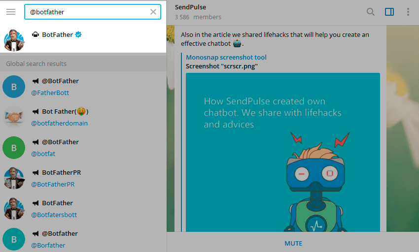
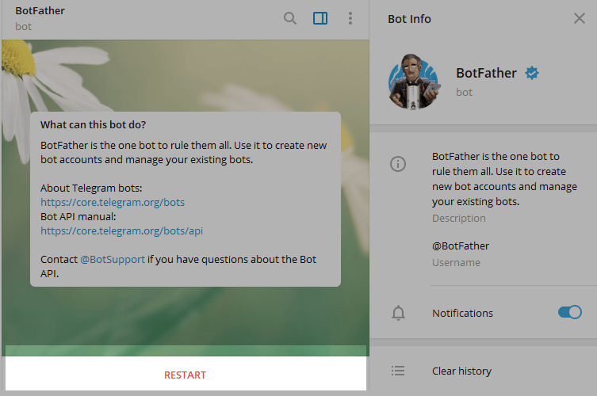
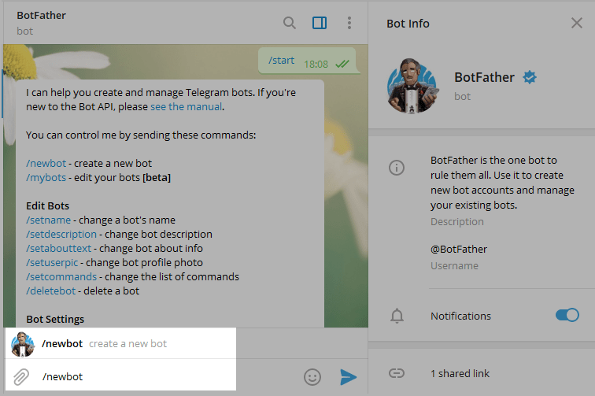
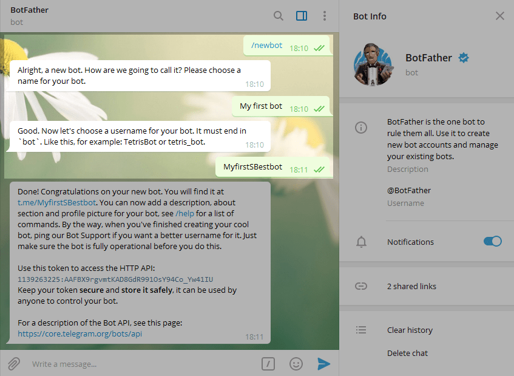
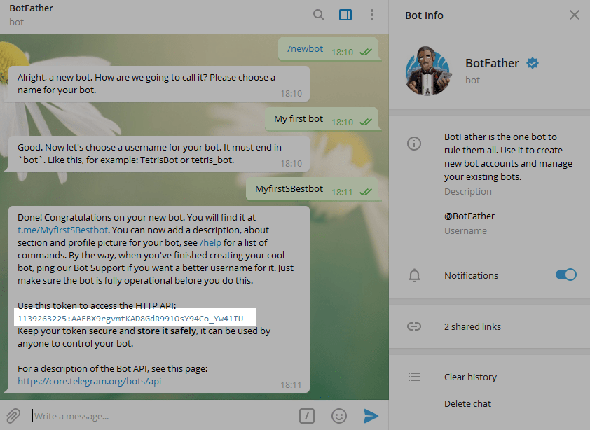

Step 1. Enter @Botfather in the search tab and choose this bot.

Official Telegram bots have a blue checkmark beside their name.

Click “Start” to activate BotFather bot.

In response, you receive a list of commands to manage bots.

Step 2. Choose or type the /newbot command and send it.

Step 3. Choose a name for your bot — your subscribers will see it in the conversation. And choose a username for your bot — the bot can be found by its username in searches. The username must be unique and end with the word “bot.”

After you choose a suitable name for your bot — the bot is created. You will receive a message with a link to your bot t.me/<bot_username>, recommendations to set up a profile picture, description, and a list of commands to manage your new bot.

To connect a bot to SendPulse you need a token. Copy your token value and find more information about connecting your bot to SendPulse in the last section of this article.

